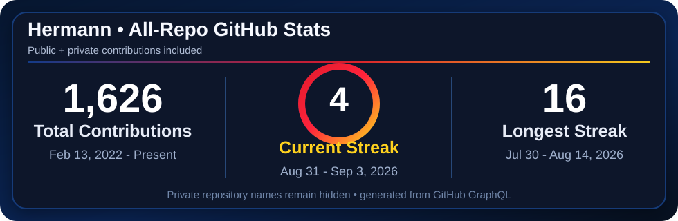
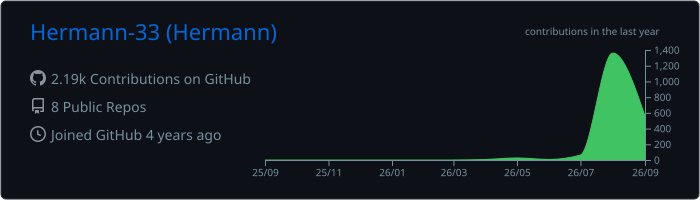
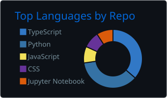
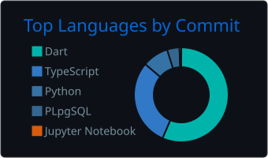
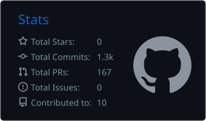
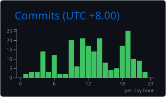

# Hermann

Building practical software, automation tools, and learning systems.

## GitHub Stats

 

 

 

## Public Projects

- [**ClipDis**](https://github.com/Hermann-33/ClipDis) — Windows tray app that compresses gaming clips and uploads them to Discord.
- [**cm-discord-bot**](https://github.com/Hermann-33/cm-discord-bot) — Discord automation project.
- [**Stone-Set**](https://github.com/Hermann-33/Stone-Set) — Dart project with a deployed web build.
- [**Fundamentals-of-Python**](https://github.com/Hermann-33/Fundamentals-of-Python) — Python learning and notebook work.
- [**StudentX**](https://github.com/Hermann-33/StudentX) — Python project.

---

  Private repository names remain hidden. Aggregate stats refresh automatically every day.

